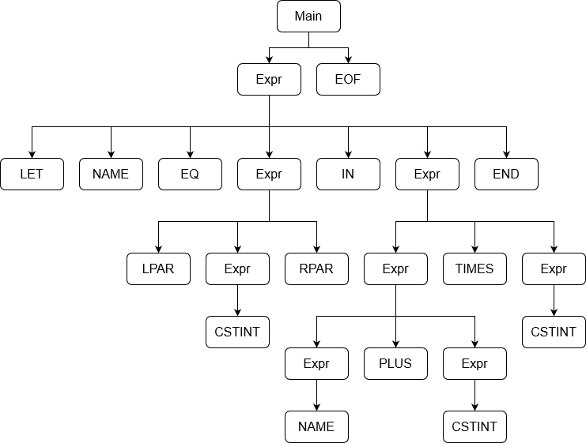

# handin3-pad

## PLC

### 3.3

```text
    Write out the rightmost derivation of the string below from the expression grammar at the end of Sect. 3.6.5, corresponding to ExprPar.fsy. Take note
    of the sequence of grammar rules (A–I) used.
    ---
    Main ::= Expr EOF               rule A
    Expr ::= NAME                   rule B
    | CSTINT                        rule C
    | MINUS CSTINT                  rule D
    | LPAR Expr RPAR                rule E
    | LET NAME EQ Expr IN Expr END  rule F
    | Expr TIMES Expr               rule G
    | Expr PLUS Expr                rule H
    | Expr MINUS Expr               rule I
```

`let z = (17) in z + 2 * 3 end EOF`

Main

Rule A → **Expr** EOF

Rule F → LET NAME EQ *Expr* IN **Expr** END EOF

Rule G → LET NAME EQ *Expr* IN *Expr* TIMES **Expr** END EOF

Rule C → LET NAME EQ *Expr* IN **Expr** TIMES CSTINT END EOF

Rule H → LET NAME EQ *Expr* IN *Expr* PLUS **Expr** TIMES CSTINT END EOF

Rule C → LET NAME EQ *Expr* IN **Expr** PLUS CSTINT TIMES CSTINT END EOF

Rule B → LET NAME EQ **Expr** IN NAME PLUS CSTINT TIMES CSTINT END EOF

Rule E → LET NAME EQ LPAR **Expr** RPAR IN NAME PLUS CSTINT TIMES CSTINT END EOF

Rule C → LET NAME EQ LPAR CSTINT RPAR IN NAME PLUS CSTINT TIMES CSTINT END EOF

### 3.4



### 3.5

Done...

### 3.6

```fsharp
let compString s =
    s |> fromString
    |> scomp <| [];;
```

### 3.7

Below is displayed all code that was modified...

**`Absyn.fs`**

```fsharp
type expr = 
  | CstI of int
  | Var of string
  | Let of string * expr * expr
  | If of expr * expr * expr
  | Prim of string * expr * expr
```

**`ExprLex.fsl`**

```fsharp
type expr = 
| CstI of int
| Var of string
| Let of string * expr * expr
| If of expr * expr * expr
| Prim of string * expr * expr
```

**`ExprPar.fsy`**

```text
Expr:
    NAME                                { Var $1            }
| CSTINT                              { CstI $1           }
| MINUS CSTINT                        { CstI (- $2)       }
| LPAR Expr RPAR                      { $2                }
| LET NAME EQ Expr IN Expr END        { Let($2, $4, $6)   }
| IF Expr THEN Expr ELSE Expr         { If($2, $4, $6)    }
| Expr TIMES Expr                     { Prim("*", $1, $3) }
| Expr PLUS  Expr                     { Prim("+", $1, $3) }  
| Expr MINUS Expr                     { Prim("-", $1, $3) }
;
```
